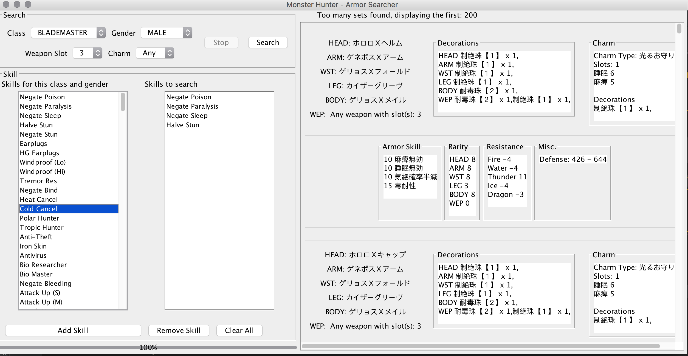

Monster Hunter Armor Searcher

Given a list search requirements, the program will try to find if there exist a possible set.

TODO:
1. need to add in mantis set.
2. add in filter by defense, rarity... etc
3. language support

implementation:
1. use DP to generate the all the possible set for 1..n slotted charms.
2. use DP to generate all the possible skill (selected from user) by using the answer from step 1.
3. Check if we have our desired set entered by the user, if no try brute forcing a valid charm.

